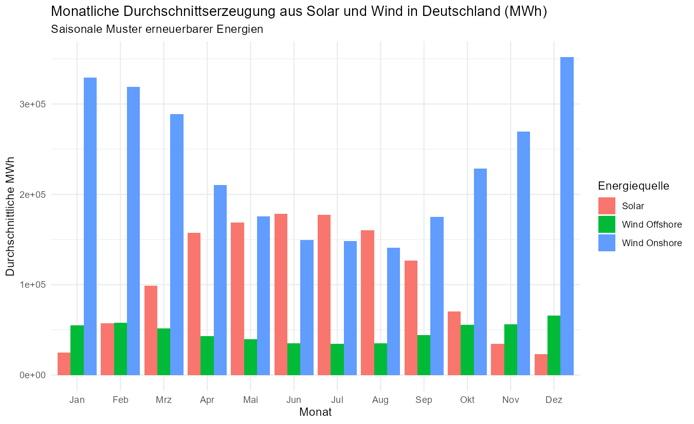
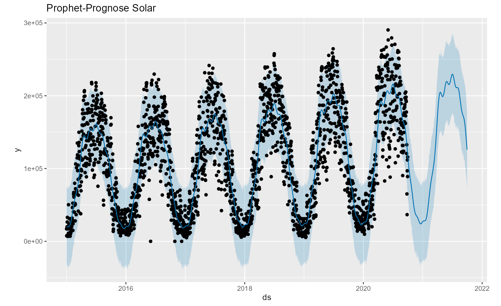

# Zeitreihenanalyse und Prognose der Stromerzeugung aus Erneuerbaren Energien in Deutschland

**Autorin:** Jaqueline Lange, M.Sc. Biologie (Umweltwissenschaften und Datenanalyse)  
Aachen, Deutschland

Kontakt: [Jaqueline Lange auf LinkedIn](https://www.linkedin.com/in/jaqueline-lange-jl/)

**Letzte Aktualisierung:** 17. Oktober 2025  
**Programmiersprache:** R (Version 4.5.1)  
**RStudio-Version:** 2025.09.0+387  

---

## Projektbeschreibung

Dieses Projekt analysiert und prognostiziert die Stromerzeugung aus erneuerbaren Energiequellen in Deutschland  
(Solar, Wind Onshore und Wind Offshore) auf Basis von **Open Power System Data (OPSD)**.

Ziel ist es, saisonale Muster, Trends und Schwankungen in den Zeitreihen zu erkennen  
und Prognosen mithilfe klassischer (ARIMA) und moderner (Prophet) Modelle zu erstellen.

Das Projekt dient zugleich als Portfolio-Beispiel für datengetriebene Energieanalysen und Zeitreihenmodellierung.

---

## Methoden und Modelle

**1. Datenvorbereitung**

- Bereinigung und Aggregation von OPSD-Stromerzeugungsdaten  
- Visualisierung von Trends, saisonalen Mustern und Variabilität  

**2. Zeitreihenanalyse**

- STL-Dekomposition (Trend, Saisonalität, Reste)  
- Stationaritätsprüfung (ADF-Test, ACF)  
- Modellierung und Prognose mit ARIMA  
- Modellierung und Prognose mit Facebook Prophet (additiv und multiplikativ)  
- Vergleich der Modelle anhand von Fehlerkennzahlen:  
  RMSE, MAE, MAPE, sMAPE, MdAPE, Coverage  

---

## Projektstruktur

erneuerbare_energie/

├─ data/

│ └─ time_series_60min_singleindex_DE.csv

├─ plots/ 

├─ erneuerbare_energie.Rmd 

├─ erneuerbare_energien_analytics.R 

├─ erneuerbare_energie.Rproj 

├─ README.md 

└─ .gitignore

---

## Reproduzierbarkeit

1. **Projekt öffnen**  
   Öffne die Datei `erneuerbare_energie.Rproj` in RStudio.

2. **Plots erzeugen**  
   Führe `erneuerbare_energien_analytics.R` aus.  
   Alle Grafiken werden automatisch im Ordner `plots/` gespeichert.

3. **Bericht erstellen**  
   Öffne `erneuerbare_energie.Rmd` und klicke auf Knit.  
   Es wird ein vollständiger HTML-Bericht erstellt.

---

## HTML-Projektbericht anzeigen

Der vollständige Projektbericht ist ebenfalls hier anzusehen:

[Erneuerbare_Energien (HTML)](https://htmlpreview.github.io/?https://github.com/jlange-hub/erneuerbare_energie/blob/main/erneuerbare_energien.html)

## Visualisierungen

| Zeitreihen monatlich aggregiert| Prophet-Prognose |
|------------|-----------------|
|  |  |

---

## Verwendete R-Pakete

- tidyverse  
- lubridate  
- forecast  
- tseries  
- zoo  
- prophet  
- here

---

## Datenquelle und Lizenz

Die Daten stammen von **Open Power System Data (OPSD)** 

Open Power System Data. (2020). *Time Series Data Package (2020-09-06)*.  
[https://data.open-power-system-data.org/time_series/](https://data.open-power-system-data.org/time_series/)

**Lizenz:** [Creative Commons Attribution 4.0 International (CC BY 4.0)](https://creativecommons.org/licenses/by/4.0/) 

---

## Ausblick

- Einbezug meteorologischer Einflussgrößen (z. B. Windgeschwindigkeit, Temperatur)

- Kombination klassischer und maschineller Verfahren (z. B. Hybridmodelle aus ARIMA und LSTM)

- Interaktive Dashboards (z.B. mit Tableau) zur Darstellung der Prognosen
